# The Walker Game

A small first-person exploration game where player navigates through the area and discovers hidden objects.

## Game Overview

Main goal was to create a small game with two main mechanics:
- Exploration
- Object collection

Players will find themselves in abandoned area with a mysterious house and a garden.

## Player controls
  - WASD movement
  - Mouse-look camera controls
  - Interaction system for picking up items with popup hints

## Development

### 3D Modeling in Blender

| Stage 1 | Stage 2 | Stage 3 |
|---------|---------|---------|
| 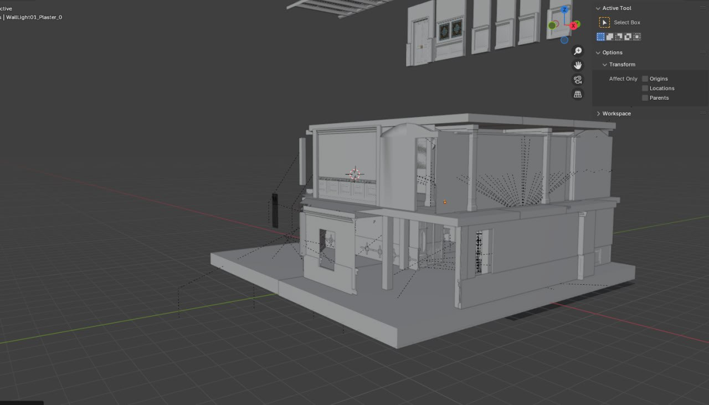 | 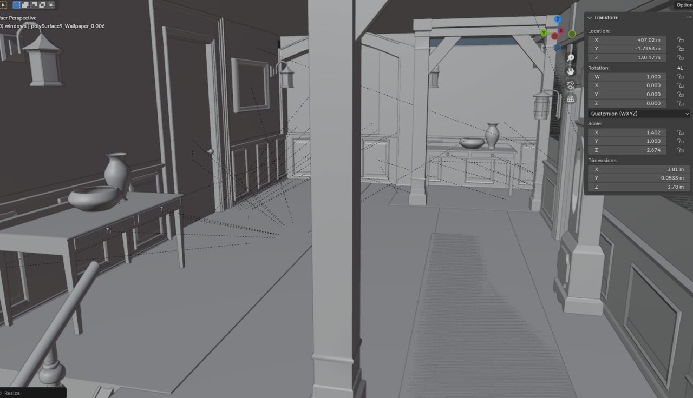 | 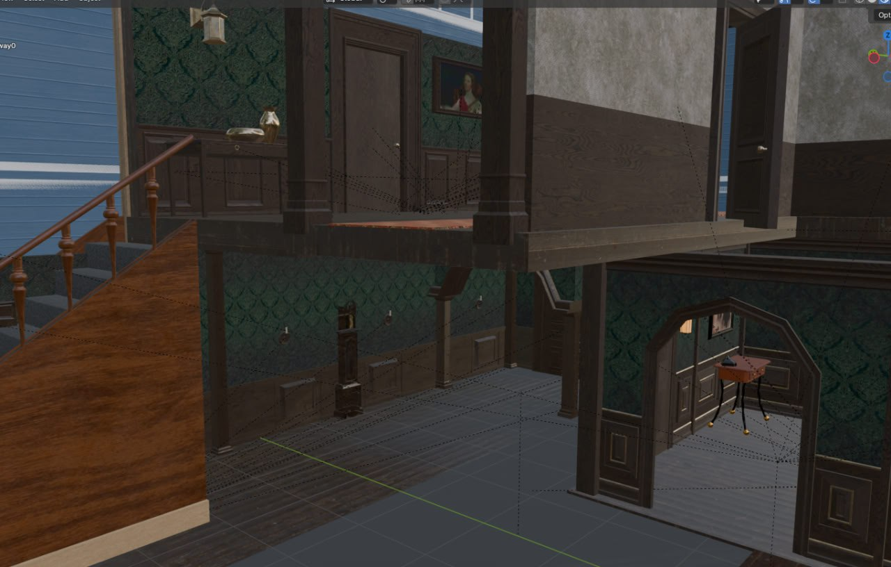 |
| House model creation | Interior development | Final touches |

### Area overview in Unreal Engine

| Stage 1 | Stage 2 | Stage 3 |
|---------|---------|---------|
| 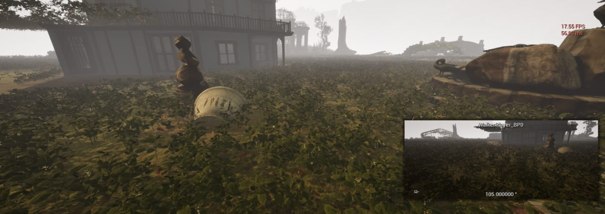 | 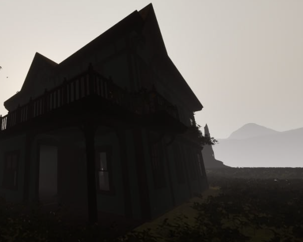 | 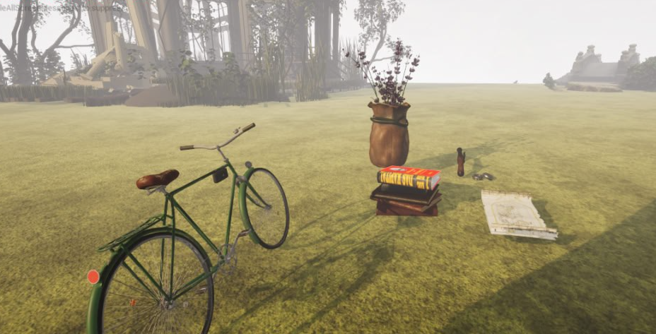 |
| Abandoned garden | House | Collectables |

### Interior Development

| Stage 1 | Stage 2 | Stage 3 |
|---------|---------|---------|
| 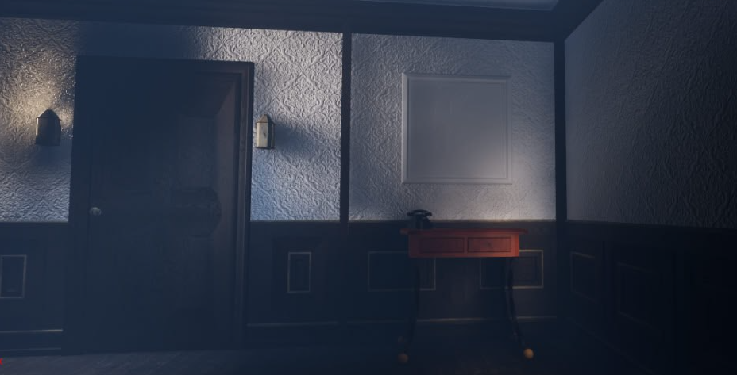 | 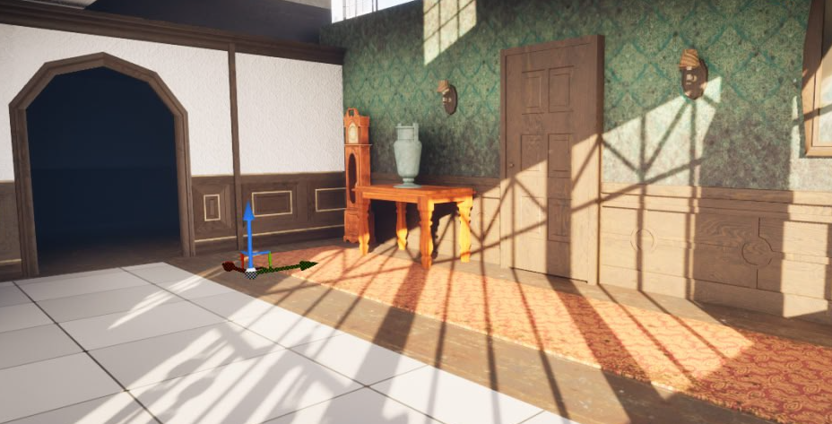 | 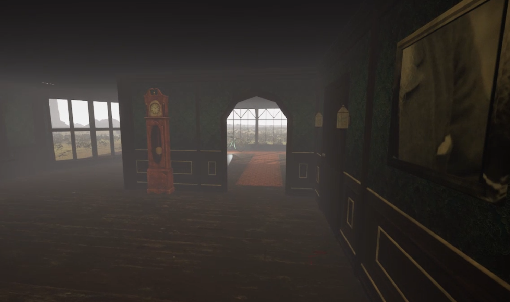 |
| Light placing | Intermediate result | Final interior |

### Gameplay Overview

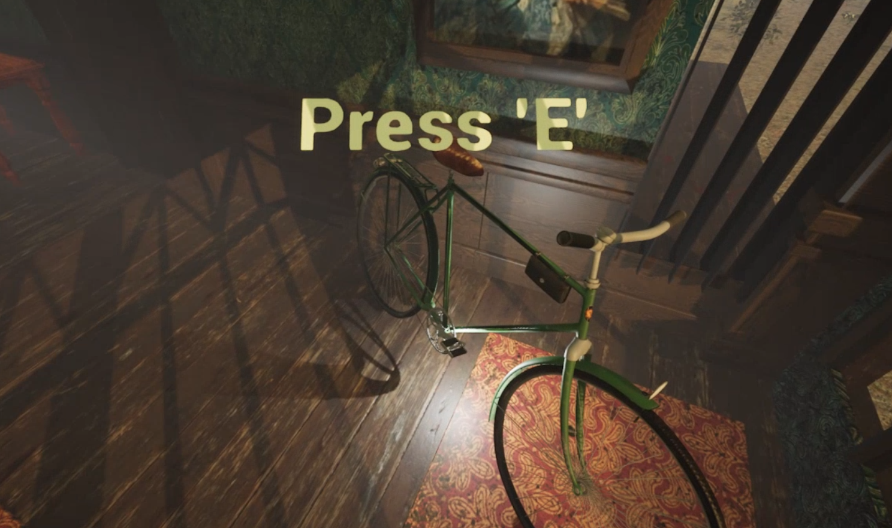
Popup hint that occurs when player comes closer to collectable.
Collectables are hightlighted with source of light.

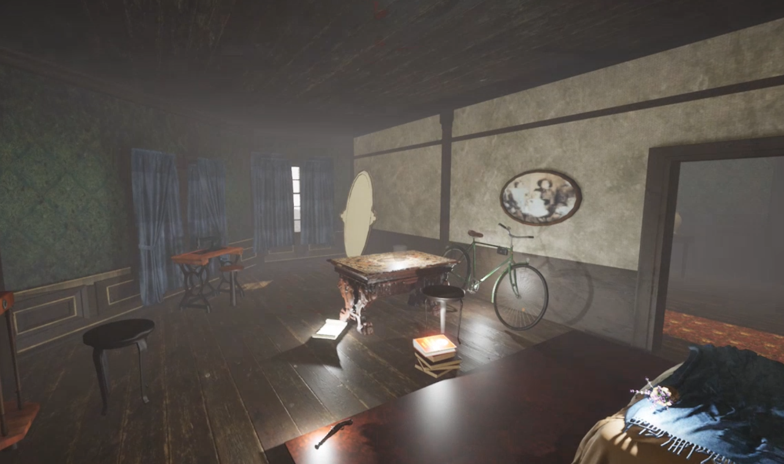
When all an item is being collected, it moves to the bedroom (quite mysteriously :))

## Gameplay video

https://github.com/user-attachments/assets/3e082019-74ab-4e61-9ab9-a694567e0210

## Lastly

The main goal was to implement minimal playable example with possible further refinement and optimization
